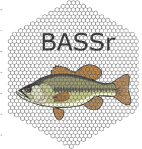

<!-- README.md is generated from README.Rmd. Please edit that file -->

# BASSr <a href="https://davidhope.ca/BASSr/"></a>

<!-- badges: start -->

[](https://dhope.r-universe.dev/BASSr)
[](https://www.repostatus.org/#active)
[](https://app.codecov.io/gh/dhope/BASSr)
<!-- badges: end -->

## Overview

This is the code associated with CWS Ontario’s preferred approach to
sampling Boreal Birds in our boreal forest. The code should allow you to
start understanding our process. The vignettes associated with the
package are a good place to start.

## Installation

The simpliest way to install “BASSr” is from
[r-universe](https://dhope.r-universe.dev/BASSr):

``` r
install.packages("BASSr",
                 repos = "https://dhope.r-universe.dev" )
```

This will allow you to install from a binary version.

## Devlopment version

Install the development version from [GitHub](https://github.com/):

``` r
remotes::install_github("dhope/BASSr")
```

This will require compiling from source and could need additional
installations of external software.

## Usage

## Learn to use

The easiest way to dig into using the `BASSr` package is using the
[documentation webpage](https://davidhope.ca/BASSr/)

There currently are a few in progress vignettes that will help you get
started.

- Getting started with BASSr (`vignette("BASSr")`)
- Some real data examples (`vignette("BASSr_real")`)
- Step by step of benefit calculation
  (`vignette("BASS_Benefit_Step_by_Step")`)
- Details of cost model (`vignette("CostBreakDown")`)
