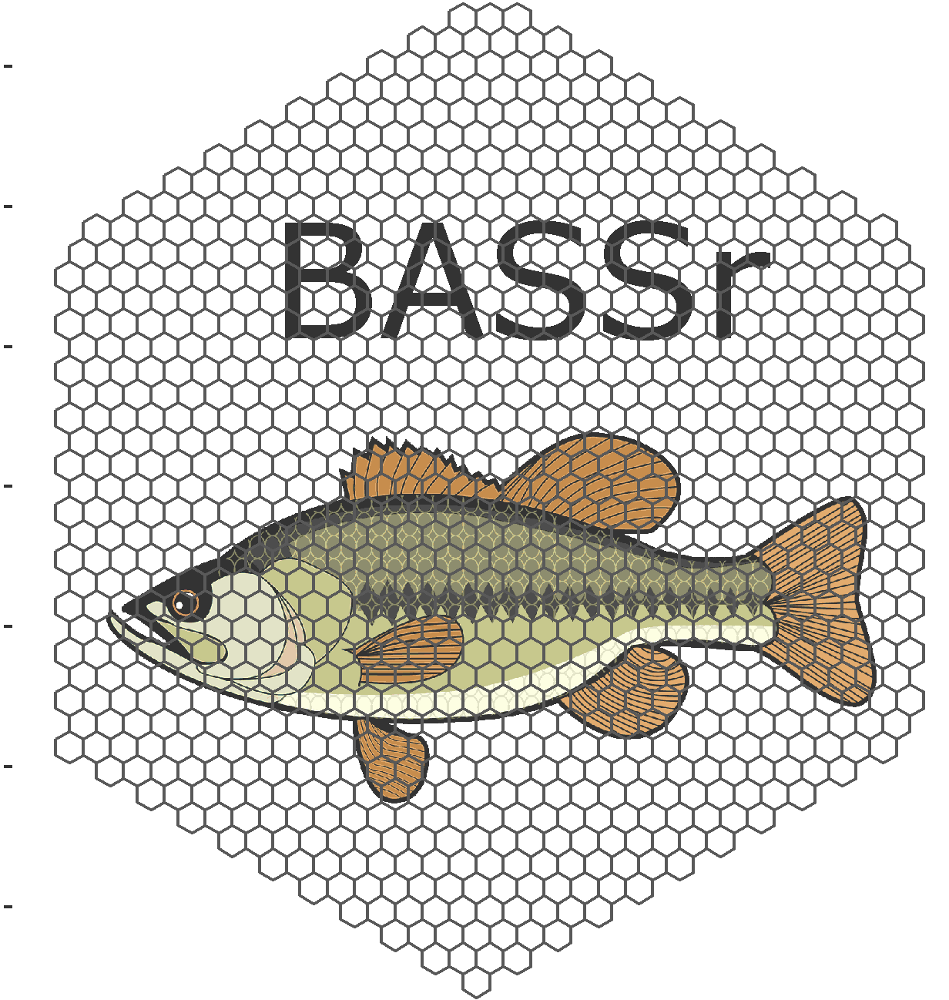

<!-- README.md is generated from README.Rmd. Please edit that file -->

# BASSr <a href=''></a>

## Overview

This is the code associated with CWS Ontario’s preferred approach to
sampling Boreal Birds in our boreal forest. The code should allow you to start
understanding our process. The vignettes associated with the package are
a good place to start.

## Installation

Install the development version from [GitHub](https://github.com/):

``` r
devtools::install_github("dhope/BASSr")
```

## Usage

See vignettes for now. Details to come.

``` r
devtools::install_github("dhope/BASSr", build_vignettes = TRUE)
```
