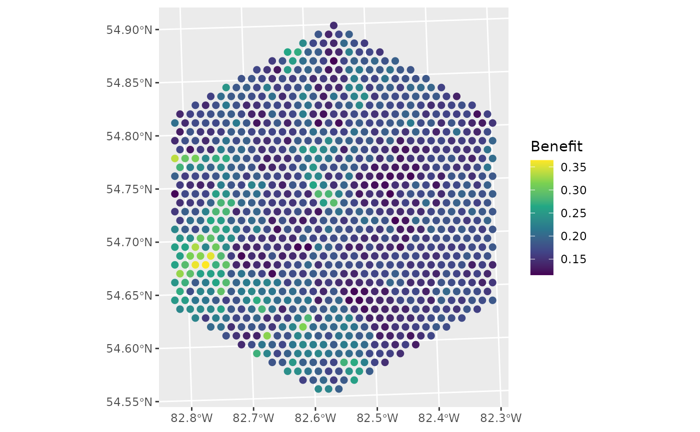
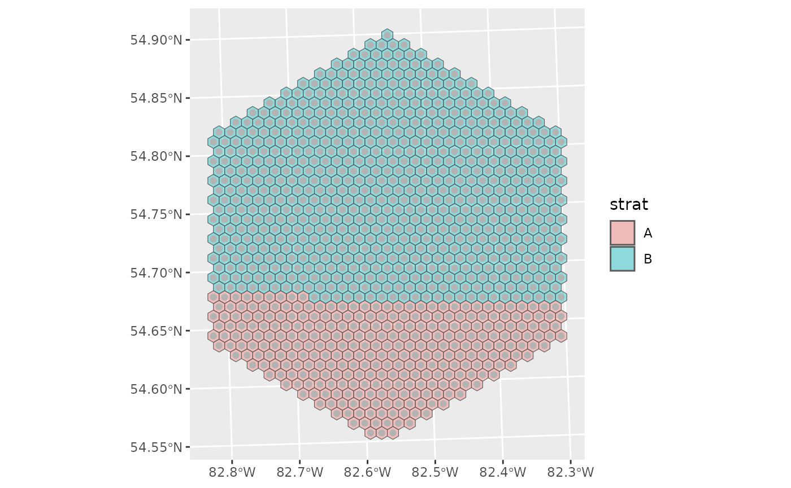

# Getting Started - Some real data

``` r
library(BASSr)
library(sf)
```

    ## Linking to GEOS 3.12.1, GDAL 3.8.4, PROJ 9.4.0; sf_use_s2() is TRUE

``` r
library(ggplot2)
library(dplyr)
```

    ## 
    ## Attaching package: 'dplyr'

    ## The following objects are masked from 'package:stats':
    ## 
    ##     filter, lag

    ## The following objects are masked from 'package:base':
    ## 
    ##     intersect, setdiff, setequal, union

## Setup

1.  Get spatial data - Hexagonal grid (primary spatial units - PSU) with
    land cover characteristics for each hex
2.  Get cost data
3.  Run
    [`full_BASS_run()`](https://davidhope.ca/BASSr/reference/full_BASS_run.md)

### 1. Spatial Data

- Spatial data frame (sf object) with
  - Columns Cell/Hex ID (e.g., `ET_Index`, `hex_id`)
  - Columns defining land cover (e.g., CORINE land cover CLC `CLC15_1`)
- This must be either POINT or (MULTI)POLYGON (will be converted to
  points)

> Land cover characteristics should not be percentages, but should be
> XXXX?

**Clean up hex data**

``` r
ont_hex <- clean_land_cover(StudyArea_hexes$landcover,  pattern = "LC")
```

    ## ℹ Renaming land cover columns
    ## • From: LC02, LC05, LC08, LC10, LC12, LC13, LC14, LC01, LC18, LC06, LC16, LC17, LC11
    ## • To: LC02, LC05, LC08, LC10, LC12, LC13, LC14, LC01, LC18, LC06, LC16, LC17, LC11

Where are we looking?

``` r
ggplot() +
  geom_sf(data = ontario) +
  geom_sf(data = ont_hex)
```


What does this landscape look like specifically? (Thinking about LC01)

``` r
ggplot() +
  geom_sf(data = ont_hex, aes(fill = LC01)) +
  scale_fill_viridis_c()
```


### Basic Run

``` r
d <- full_BASS_run(land_hex = ont_hex, 
                   num_runs = 10,
                   n_samples = 3,
                   hex_id = SampleUnitID)
```

    ## ℹ Spatial object land_hex should be POINTs not POLYGONs
    ## • Don't worry, I'll fix it!
    ## • Assuming constant attributes and using centroids as points
    ## ℹ Finished GRTS draw of 10 runs and 3 samples

    ## Warning: ! Values across LC columns sum to 100 or 1, 
    ## ℹ Check to be sure you have not input inputed percentages into your values.
    ## ✖ Using percentages will not calculate accurate benefit values.

``` r
ggplot(data = d, aes(colour = benefit)) +
  geom_sf(size = 2) +
  labs(colour = "Benefit") +
  scale_colour_viridis_c()
```



``` r
# For pretty plotting
d_hex <- left_join(ont_hex, st_drop_geometry(d), by = "SampleUnitID")

ggplot(data = d_hex, aes(fill = benefit)) +
  geom_sf() +
  labs(fill = "Benefit") +
  scale_fill_viridis_c()
```


### Including Costs

``` r
costs <- StudyArea_hexes$cost

d <- full_BASS_run(land_hex = ont_hex, 
                   num_runs = 10,
                   n_samples = 3,
                   costs = costs,
                   hex_id = SampleUnitID,
                   seed = 1234)
```

    ## ℹ Spatial object land_hex should be POINTs not POLYGONs
    ## • Don't worry, I'll fix it!
    ## • Assuming constant attributes and using centroids as points
    ## ℹ Finished GRTS draw of 10 runs and 3 samples

    ## Warning: ! Values across LC columns sum to 100 or 1, 
    ## ℹ Check to be sure you have not input inputed percentages into your values.
    ## ✖ Using percentages will not calculate accurate benefit values.

``` r
d_hex <- left_join(ont_hex, st_drop_geometry(d), by = "SampleUnitID")

ggplot(data = d_hex, aes(fill = inclpr)) +
  geom_sf() +
  labs(fill = "Inclusion\nProbability") +
  scale_fill_viridis_c()
```


Perhaps we should omit sites in water. These are identified in the
`costs` data by `TRUE`/`FALSE`s in the column `INLAKE` and can be
omitted by using the `omit_flag` argument.

``` r
d <- full_BASS_run(land_hex = ont_hex, 
                   num_runs = 10,
                   n_samples = 3,
                   costs = costs,
                   hex_id = SampleUnitID,
                   omit_flag = INLAKE,
                   seed = 1234)
```

    ## ℹ Spatial object land_hex should be POINTs not POLYGONs
    ## • Don't worry, I'll fix it!
    ## • Assuming constant attributes and using centroids as points
    ## ℹ Finished GRTS draw of 10 runs and 3 samples

    ## Warning: ! Values across LC columns sum to 100 or 1, 
    ## ℹ Check to be sure you have not input inputed percentages into your values.
    ## ✖ Using percentages will not calculate accurate benefit values.

``` r
d_hex <- left_join(ont_hex, st_drop_geometry(d), by = "SampleUnitID")

ggplot(data = d_hex, aes(fill = inclpr)) +
  geom_sf() +
  labs(fill = "Inclusion\nProbability") +
  scale_fill_viridis_c()
```


The grey hexes have been omitted.

What if the costs of that highly beneficial point was much higher?

``` r
which.max(d$inclpr)
```

    ## [1] 599

``` r
high_cost <- costs
high_cost$RawCost[559] <- high_cost$RawCost[559] * 100

d <- full_BASS_run(land_hex = ont_hex, 
                   num_runs = 10,
                   n_samples = 3,
                   costs = high_cost,
                   hex_id = SampleUnitID)
```

    ## ℹ Spatial object land_hex should be POINTs not POLYGONs
    ## • Don't worry, I'll fix it!
    ## • Assuming constant attributes and using centroids as points
    ## ℹ Finished GRTS draw of 10 runs and 3 samples

    ## Warning: ! Values across LC columns sum to 100 or 1, 
    ## ℹ Check to be sure you have not input inputed percentages into your values.
    ## ✖ Using percentages will not calculate accurate benefit values.

``` r
d_hex <- left_join(ont_hex, st_drop_geometry(d), by = "SampleUnitID")

ggplot(data = d_hex, aes(fill = inclpr)) +
  geom_sf() +
  labs(fill = "Inclusion\nProbability") +
  scale_fill_viridis_c()
```


Not a great option any more.

### Runs by ‘hand’

``` r
on_hex <- clean_land_cover(StudyArea_hexes$landcover,  pattern = "LC")
```

    ## ℹ Renaming land cover columns
    ## • From: LC02, LC05, LC08, LC10, LC12, LC13, LC14, LC01, LC18, LC06, LC16, LC17, LC11
    ## • To: LC02, LC05, LC08, LC10, LC12, LC13, LC14, LC01, LC18, LC06, LC16, LC17, LC11

``` r
samples <- draw_random_samples(on_hex, num_runs = 10, n_samples = 3,
                               seed = 1234)
```

    ## ℹ Spatial object land_hex should be POINTs not POLYGONs
    ## • Don't worry, I'll fix it!
    ## • Assuming constant attributes and using centroids as points
    ## ℹ Finished GRTS draw of 10 runs and 3 samples

``` r
benefit <- calculate_benefit(on_hex, samples, hex_id = SampleUnitID)
```

    ## ℹ Spatial object land_hex should be POINTs not POLYGONs
    ## • Don't worry, I'll fix it!
    ## • Assuming constant attributes and using centroids as points

    ## Warning: ! Values across LC columns sum to 100 or 1, 
    ## ℹ Check to be sure you have not input inputed percentages into your values.
    ## ✖ Using percentages will not calculate accurate benefit values.

``` r
inc_prob <- calculate_inclusion_probs(benefit, 
                                      costs = costs, 
                                      hex_id = SampleUnitID)

d_hex <- left_join(on_hex, st_drop_geometry(inc_prob), by = "SampleUnitID")

ggplot(data = d_hex, aes(fill = inclpr)) +
  geom_sf() +
  labs(fill = "Inclusion\nProbability") +
  scale_fill_viridis_c()
```


Alternative pipe

``` r
ont_hex <- clean_land_cover(StudyArea_hexes$landcover, pattern = "LC")
```

    ## ℹ Renaming land cover columns
    ## • From: LC02, LC05, LC08, LC10, LC12, LC13, LC14, LC01, LC18, LC06, LC16, LC17, LC11
    ## • To: LC02, LC05, LC08, LC10, LC12, LC13, LC14, LC01, LC18, LC06, LC16, LC17, LC11

``` r
final <- ont_hex |>
  draw_random_samples(num_runs = 10, n_samples = 3) %>%
  calculate_benefit(ont_hex, samples = ., hex_id = SampleUnitID) %>%
  calculate_inclusion_probs(costs = costs, hex_id = SampleUnitID)
```

    ## ℹ Spatial object land_hex should be POINTs not POLYGONs
    ## • Don't worry, I'll fix it!
    ## • Assuming constant attributes and using centroids as points
    ## ℹ Spatial object land_hex should be POINTs not POLYGONs
    ## • Don't worry, I'll fix it!
    ## • Assuming constant attributes and using centroids as points
    ## ℹ Finished GRTS draw of 10 runs and 3 samples

    ## Warning: ! Values across LC columns sum to 100 or 1, 
    ## ℹ Check to be sure you have not input inputed percentages into your values.
    ## ✖ Using percentages will not calculate accurate benefit values.

### Weights? (e.g., Akimiski_Island.Rmd)

## Calculating Costs

- Need number of ARUs which to deploy

…

## Selection probabilities

### Simple selection

Here we’ll sample 12 sites with a 20% over sample, resulting in a total
of 14 sites selected.

``` r
g <- ggplot() + 
  geom_sf(data = ont_hex, fill = "white") +
  geom_sf(data = final, colour = "grey70")

g
```


``` r
sel <- run_grts_on_BASS(probs = final, 
                        num_runs = 1, 
                        nARUs = 12, 
                        os = 0.2)

sel_plot <- bind_rows(sel[["sites_base"]],
                      sel[["sites_over"]])

g + 
  geom_sf(data = sel_plot, aes(colour = siteuse), size = 5) +
  scale_colour_viridis_d(name = "Type of\nsites sampled", end = 0.7)
```


### Stratified selection

First let’s create a dummy stratification and add it to our hexes for
plotting

``` r
final <- mutate(final, strat = c(rep("A", 300), rep("B", 703)))
ont_hex_strat <- select(final, "SampleUnitID", "strat") |> 
  st_drop_geometry() |>
  left_join(ont_hex, y = _, by = "SampleUnitID")

g <- ggplot() + 
  geom_sf(data = ont_hex_strat, aes(fill = strat), alpha = 0.4) +
  geom_sf(data = final, colour = "grey70")
g
```



Now we’ll define how we want to sample these two strata.

Let’s assume we don’t really care about habitat A, so we don’t want to
sample that one very much.

``` r
nARUs <- list("A" = 2, "B" = 50)

sel <- run_grts_on_BASS(probs = final, 
                        num_runs = 1, 
                        stratum_id = strat,
                        nARUs = nARUs, 
                        os = 0.2)

sel_plot <- bind_rows(sel[["sites_base"]],
                      sel[["sites_over"]])

g + 
  geom_sf(data = sel_plot, aes(colour = siteuse), size = 5) +
  scale_colour_viridis_d(name = "Type of\nsites sampled", end = 0.7)
```


You can see that we’ve sampled much more of B than A, and that there are
no over samples in A, which makes sense:

0.2 \* 2 = 0.4 which rounds down to 0

If we wanted an over sample for A, we could define specific over sample
amounts instead.

``` r
nARUs <- list("A" = 2, "B" = 50)
os <- list("A" = 1, "B" = 4)

sel <- run_grts_on_BASS(probs = final, 
                        num_runs = 1, 
                        stratum_id = strat,
                        nARUs = nARUs, 
                        os = os,
                        seed = 123)

sel_plot <- bind_rows(sel[["sites_base"]],
                      sel[["sites_over"]])

g + 
  geom_sf(data = sel_plot, aes(colour = siteuse), size = 5) +
  scale_colour_viridis_d(name = "Type of\nsites sampled", end = 0.7)
```


Alternatively at this point (and especially with more strata) it might
be easier to supply a data frame rather than a series of lists.

``` r
nARUs <- data.frame(n = c(2, 50),
                    strat = c("A", "B"),
                    n_os = c(1, 4))

sel <- run_grts_on_BASS(probs = final, 
                        num_runs = 1, 
                        stratum_id = strat,
                        nARUs = nARUs, 
                        seed = 123)

sel_plot <- bind_rows(sel[["sites_base"]],
                      sel[["sites_over"]])

g + 
  geom_sf(data = sel_plot, aes(colour = siteuse), size = 5) +
  scale_colour_viridis_d(name = "Type of\nsites sampled", end = 0.7)
```


